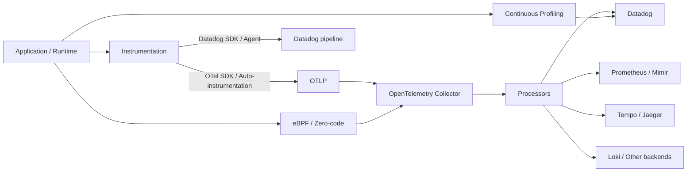
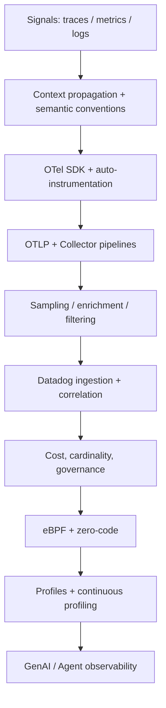

# Observability Lab

A hands-on learning and research repository for modern observability, centered on **OpenTelemetry**, **Datadog**, and adjacent technologies.

## Goals

- Build a strong mental model of traces, metrics, logs, profiles, context propagation, sampling, and telemetry pipelines.
- Understand OpenTelemetry architecture: API/SDK, auto-instrumentation, OTLP, Collector, semantic conventions, and profiles.
- Understand Datadog's native stack and its interoperability with OpenTelemetry.
- Compare vendor-neutral and vendor-specific approaches with repeatable experiments.
- Track frontier topics: eBPF/zero-code instrumentation, continuous profiling, GenAI/agent observability, cost/cardinality control, and telemetry governance.
- Keep conclusions evidence-backed: every research note should link to source docs, experiments, or measurements.

## Mental model



## Repository structure

```text
.
├── docs/
│   ├── roadmap.md
│   ├── otel/
│   ├── datadog/
│   ├── comparisons/
│   └── frontier/
├── labs/
│   ├── otel-collector/
│   └── otel-to-datadog/
├── research/
│   └── template.md
├── .github/
│   ├── ISSUE_TEMPLATE/
│   └── pull_request_template.md
└── README.md
```

## Learning path



## Current research tracks

| Track | Questions |
|---|---|
| OpenTelemetry fundamentals | What belongs in API, SDK, Collector, OTLP, and semantic conventions? |
| Collector architecture | How should receivers, processors, connectors, exporters, and extensions be composed? |
| Sampling | Head vs tail sampling; accuracy, cost, memory, and failure modes |
| Datadog + OTel | Native Datadog SDK vs OTel SDK; Agent vs DDOT vs upstream Collector |
| Telemetry economics | Cardinality, ingestion volume, retention, sampling, aggregation |
| eBPF | What can be observed without source changes? What context is lost? |
| Profiling | How profiles correlate with traces and other signals |
| GenAI observability | Agent/workflow/tool spans, token/cost/error metrics, evaluations |
| Kubernetes | Operator, auto-instrumentation injection, Collector deployment patterns |
| Governance | PII redaction, tenancy, routing, schema/version control |

## Working conventions

1. One research question = one Issue.
2. Every experiment records environment, versions, config, hypothesis, observations, and limitations.
3. Prefer reproducible labs over screenshots.
4. Separate facts from interpretation.
5. Record vendor-specific behavior explicitly.
6. Never commit API keys or tokens.

## References

### OpenTelemetry
- https://opentelemetry.io/docs/
- https://opentelemetry.io/docs/specs/otel/
- https://opentelemetry.io/docs/specs/otlp/
- https://opentelemetry.io/docs/collector/
- https://opentelemetry.io/docs/zero-code/

### Datadog
- https://docs.datadoghq.com/opentelemetry/
- https://docs.datadoghq.com/opentelemetry/getting_started/
- https://docs.datadoghq.com/opentelemetry/setup/ddot_collector/
- https://docs.datadoghq.com/llm_observability/

## Suggested first 6 issues

- [ ] Build a minimal OTLP traces/metrics/logs pipeline with the OpenTelemetry Collector
- [ ] Compare OTel SDK → upstream Collector → Datadog vs Datadog SDK → Agent/DDOT
- [ ] Evaluate head sampling vs tail sampling under error-heavy traffic
- [ ] Measure high-cardinality metric impact and mitigation techniques
- [ ] Prototype eBPF/zero-code instrumentation and document coverage gaps
- [ ] Trace a small LLM/agent workflow using OpenTelemetry GenAI semantics and Datadog
