# Datadog Inferred Services Research

> Research date: 2026-09-28  
> Scope: Datadog APM **Inferred Services**, with emphasis on OpenTelemetry interoperability.

## 1. Executive summary

Datadog Inferred Services are **remote dependency entities derived from outbound tracing data**. They are not separately instrumented services and they are not generated by machine-learning inference.

The useful mental model is:

```text
Inferred Service
=
Outbound Span
+ Semantic Attributes
+ Peer Identity Resolution
+ Entity Classification
+ APM Stats Aggregation
```

A traced service may call PostgreSQL, Redis, Kafka, a cloud service, or an external HTTP API even when those dependencies do not emit their own APM spans. If the caller emits sufficiently descriptive CLIENT or PRODUCER spans, Datadog can infer the downstream entity and expose it in dependency-oriented views.

This makes Inferred Services an important bridge between:

- span semantics,
- OpenTelemetry semantic conventions,
- Datadog peer-service aggregation,
- service/dependency topology,
- APM trace metrics,
- Datadog's broader entity model.

---

## 2. Problem being solved

Consider a single instrumented service:

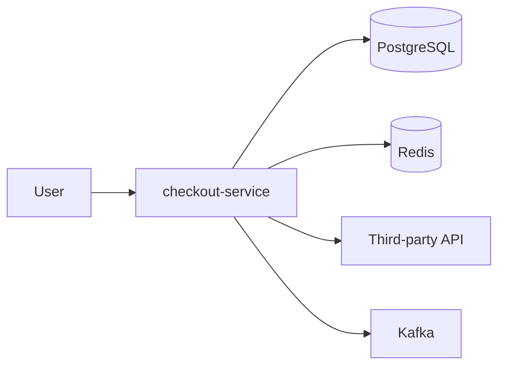

Only `checkout-service` may emit full tracing data.

Without dependency inference, a topology derived only from services that emit their own server spans would under-represent the real request path.

The caller's outbound spans already contain useful evidence:

```text
service.name = checkout-service
span.kind = CLIENT
db.system = postgresql
db.namespace = orders
server.address = postgres-prod.internal
duration = 42ms
```

From that span, Datadog can infer that `checkout-service` depends on a PostgreSQL-related entity even though PostgreSQL itself did not emit an APM service span.

---

## 3. Instrumented service vs inferred service

The distinction is fundamental.

### Fully instrumented downstream service

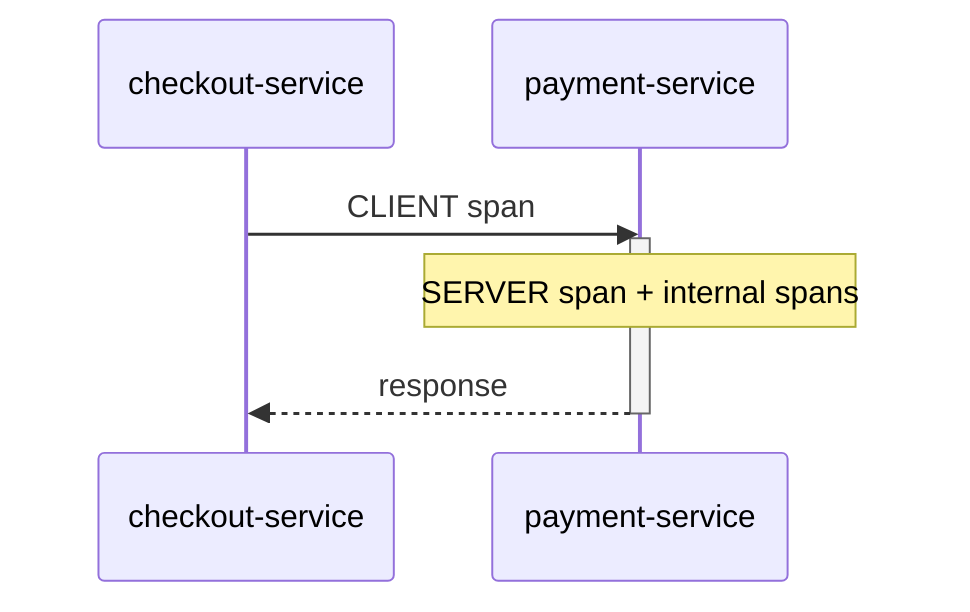

Datadog has telemetry originating from both services.

### Inferred downstream service

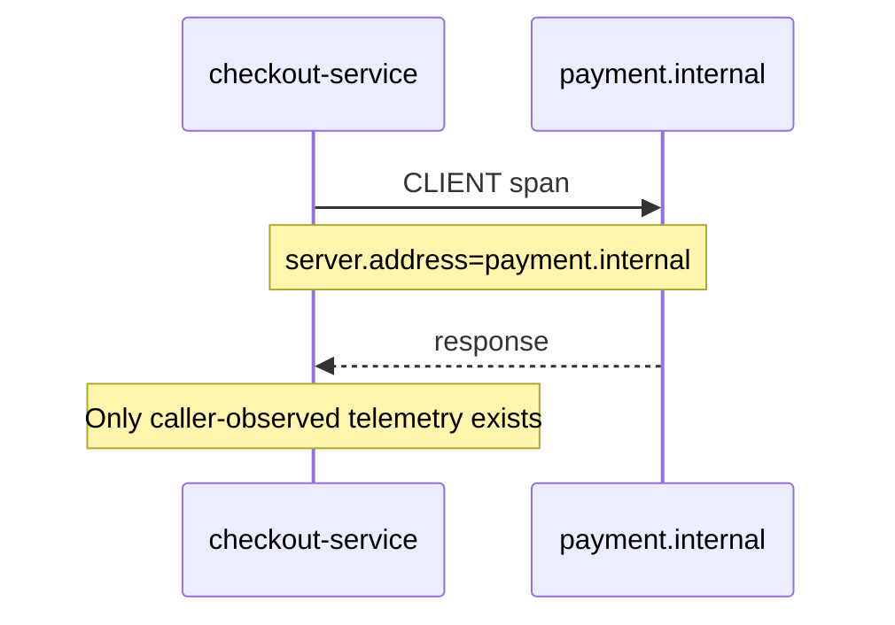

An inferred service therefore represents **what the caller can observe about the dependency**, not the remote system's internal execution.

| Capability | Instrumented service | Inferred service |
|---|---:|---:|
| Server spans | Yes | No |
| Internal spans | Possible | No |
| Runtime telemetry | Possible | No |
| Downstream topology from remote side | Possible | Usually unknown |
| Caller-observed latency | Yes | Yes |
| Caller-observed errors | Yes | Yes |
| Dependency node/entity | Yes | Yes |
| Request/error/latency aggregation | Yes | Yes, when inference/stat aggregation is configured |

---

## 4. Core pipeline

A useful abstraction is:

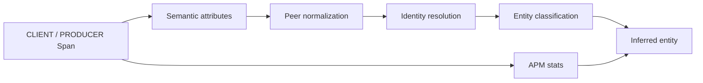

The important point is that Datadog is doing more than rendering a node on a Service Map. It is converting raw telemetry into a dependency/entity model.

---

## 5. Which spans matter

Outbound spans are the main source of evidence.

Typical OpenTelemetry `SpanKind` values:

- `CLIENT`: synchronous remote calls such as HTTP, RPC, database access.
- `PRODUCER`: publishing messages to a broker/topic/queue.
- `SERVER`: inbound request handling.
- `CONSUMER`: message consumption.
- `INTERNAL`: work internal to the process.

For inferred dependencies, `CLIENT` and `PRODUCER` are especially important because they describe interactions leaving the local service boundary.

Datadog exposes configuration around span-kind-based stats:

```yaml
compute_stats_by_span_kind: true
peer_tags_aggregation: true
```

Datadog documents that these settings are enabled by default beginning with Datadog Agent 7.60.0.

---

## 6. Peer identity resolution

The central question is:

> Which attributes identify the remote dependency?

Datadog normalizes multiple tracing attributes into peer-oriented identity fields, then applies entity-specific precedence rules.

### 6.1 Generic inferred service

For a generic remote service, Datadog documents this priority:

```text
peer.service
    ↓
peer.rpc.service
    ↓
peer.hostname
```

Examples of attributes that can contribute to peer hostname include:

- `net.peer.name`
- `hostname`
- `db.hostname`
- `network.destination.name`
- `grpc.host`
- `http.host`
- `http.server_name`
- `server.address`

Example:

```text
service.name = checkout-service
span.kind = CLIENT
server.address = api.stripe.com
```

Conceptually:

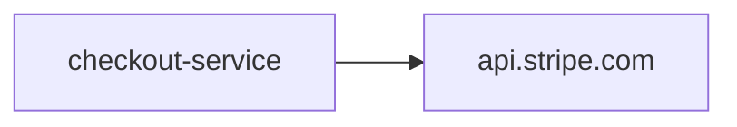

If a more explicit logical peer identity is present, it can take precedence over hostname-based identity.

---

## 7. Database inference

Database spans often expose several candidate identities:

```text
db.system = postgresql
db.namespace = orders
server.address = postgres-prod.internal
```

Possible human interpretations include:

- PostgreSQL,
- `orders`,
- `postgres-prod.internal`.

Datadog documents database peer precedence beginning with a database-specific logical name, then system-specific cloud/database identifiers, hostname, and finally database system.

Representative Datadog peer attributes include:

- `peer.db.name`
- `peer.hostname`
- `peer.db.system`

The normalized database name can originate from attributes such as:

- `db.name`
- `mongodb.db`
- `db.instance`
- `cassandra.keyspace`
- `db.namespace`

This means entity naming is not simply "use `db.system`".

A useful conceptual result is:

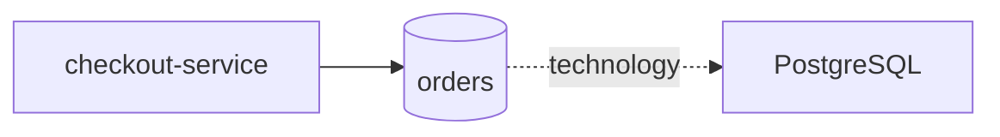

The exact rendered entity depends on the instrumentation and Datadog's normalization rules.

---

## 8. Messaging and queue inference

Messaging spans create a similar identity problem.

Example OpenTelemetry attributes:

```text
span.kind = PRODUCER
messaging.system = kafka
messaging.destination.name = order.created
server.address = kafka.internal
```

Candidate identities include:

- Kafka as technology,
- `kafka.internal` as broker address,
- `order.created` as logical destination.

Datadog prioritizes the messaging destination identity over a generic messaging-system identity when sufficient attributes are present.

This is useful because:

```text
checkout-service -> Kafka
```

contains less application context than:

```text
checkout-service -> order.created
```

For dependency analysis, the logical destination often represents the more useful business-level edge.

---

## 9. Why peer aggregation is necessary

Suppose one local service produces these outbound calls:

```text
checkout -> postgres
checkout -> postgres
checkout -> api.stripe.com
checkout -> api.stripe.com
checkout -> api.stripe.com
```

If metrics are aggregated only by local service:

```text
service=checkout
requests=5
```

the dependency structure disappears.

With peer-oriented dimensions retained:

```text
service=checkout, peer=postgres
requests=2

service=checkout, peer=api.stripe.com
requests=3
```

Datadog can derive dependency-level request, error, and latency statistics.

Conceptually:

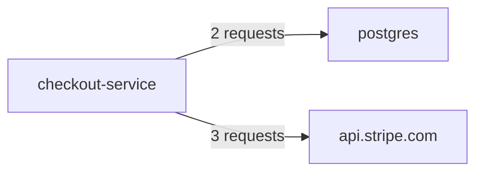

This explains the purpose of `peer_tags_aggregation`: the peer identity must survive metric aggregation if dependency-level statistics are going to exist.

---

## 10. Relationship to Datadog APM metrics

Datadog Trace Metrics capture:

- request counts,
- error counts,
- latency/duration measurements.

For native Datadog tracing, these metrics are normally computed from 100% of application traffic independent of later trace-ingestion sampling.

OpenTelemetry changes the picture if sampling happens too early.

### Problematic pipeline

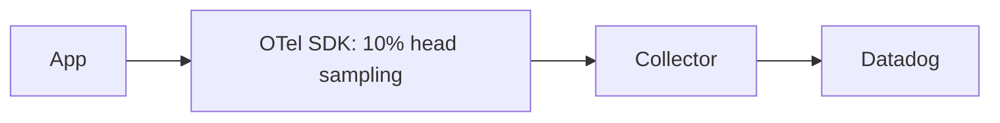

If 90% of spans are dropped in the SDK, Datadog never receives them. Metrics derived downstream cannot reconstruct the missing traffic.

### Better Collector-level pattern

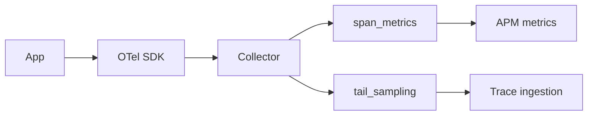

Datadog explicitly recommends configuring the `span_metrics` connector to receive traces **before sampling processors** so APM trace metrics represent unsampled traffic.

This ordering also matters for inferred-service dependency metrics because peer-service dimensions need to be observed before spans are discarded.

---

## 11. OpenTelemetry Collector integration

For new OpenTelemetry Collector configurations, Datadog currently recommends using:

- OTLP HTTP export to Datadog, and
- the `span_metrics` connector for APM trace metrics.

Datadog states that the recommended `span_metrics` configuration includes dimensions needed to derive:

- host tags,
- peer services,
- operation names,
- resource names.

The older `peer_tags` configuration and the newer recommended `span_metrics` dimensions are not identical. Datadog explicitly warns that the inferred entities produced by the two configurations can differ.

That yields an important interoperability hypothesis:

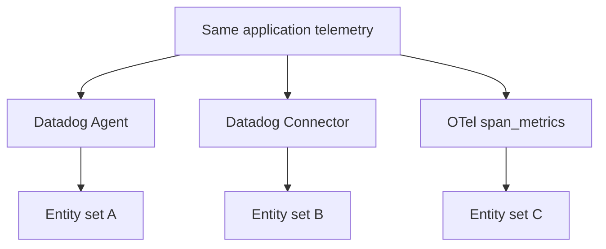

The business architecture is the same, but the derived entity topology may differ because different pipelines preserve and normalize different dimensions.

---

## 12. Relationship to OpenTelemetry semantic conventions

OpenTelemetry separates local service identity from remote dependency information.

### Local service

```text
service.name = checkout-service
```

describes the service producing telemetry.

### Remote server address

```text
server.address = payment.internal
```

describes the logical remote server address in many client-side semantic conventions.

OpenTelemetry defines `server.address` as a stable semantic-convention attribute and generally recommends a logical hostname/address rather than performing reverse DNS lookup.

### Peer service attributes

OpenTelemetry also defines:

```text
service.peer.name
service.peer.namespace
```

for the logical service on the other side of a connection.

As of this research date, these peer-service attributes are marked **Development** in OpenTelemetry semantic conventions.

Do not assume:

```text
OpenTelemetry service.peer.name
==
Datadog peer.service
```

They belong to different semantic/data models. The correct question for interoperability testing is:

> How does a specific Datadog ingestion path map a specific OpenTelemetry attribute set into Datadog peer identity and inferred entities?

---

## 13. Service naming: why inferred services improve the model

A historical anti-pattern is to use the span's service name to represent the remote dependency.

For example, one process may logically be:

```text
checkout-service
```

but integration-specific client spans might use service values such as:

```text
checkout-service
postgres
redis
http-client
```

This overloads one field with two concepts:

1. which service produced the telemetry;
2. which remote system it called.

A cleaner model is:

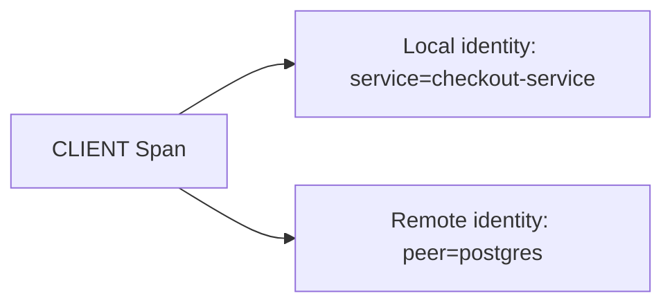

Inferred Services let Datadog model dependencies without requiring every downstream system to be encoded as a separate local service name.

---

## 14. Entity model beyond Service Map

Datadog exposes a DDSQL dataset:

```text
dd.inferred_services
```

The dataset contains backend services inferred from sources including APM, Universal Service Monitoring (USM), or Software Catalog when they do not have a fully resolved entity definition.

That suggests the larger architecture:

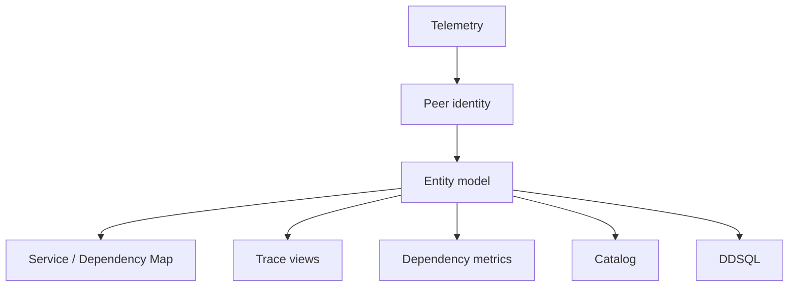

Therefore Inferred Services should be studied as part of Datadog's **entity resolution layer**, not merely as an APM visualization feature.

---

## 15. Cardinality risks

Dependency inference and cardinality management are coupled.

Potentially problematic identities include:

- ephemeral IP addresses,
- Kubernetes pod addresses,
- per-request hostnames,
- dynamic queue/topic names,
- database names derived from tenant IDs,
- user-controlled peer labels.

If unstable values become aggregation dimensions, the number of inferred entities and metric series can grow rapidly.

Datadog documents special handling for peer values that look like IP addresses; these can appear as `blocked-ip-address` rather than creating unbounded peer entities.

OpenTelemetry semantic conventions also emphasize low-cardinality logical server identities where possible.

### Design principle

Prefer:

```text
payment.default.svc.cluster.local
```

over:

```text
10.42.7.183
```

when the semantic convention and instrumentation can provide the logical identity.

---

## 16. Important failure and ambiguity cases

| Scenario | Risk |
|---|---|
| Kubernetes pod IP used as peer identity | Entity churn / high cardinality |
| Service mesh proxy | Observed peer may be proxy rather than final logical service |
| Gateway / load balancer | `server.address` may identify intermediary depending on instrumentation |
| Dynamic Kafka topics | Large number of inferred destination entities |
| SDK-level trace sampling | Dependency metrics reflect sampled traffic only |
| Manual `peer.service` values | Incorrect logical value can override more useful lower-priority identity |
| Semantic convention version changes | Same workload may emit different attribute sets |
| Mixed Datadog + OTel instrumentation | Duplicate or inconsistent dependency identity |
| Integration service overrides | Remote dependency may appear both as a service and an inferred entity |

---

## 17. Research questions for Observability-Lab

The following questions should be answered experimentally rather than assumed from documentation.

### Entity identity

1. Which exact OTel attributes become Datadog peer identity in each ingestion path?
2. How does `server.address` compare with explicit peer-service attributes?
3. What happens when both logical peer name and hostname are present?
4. How are database namespace and database hostname prioritized?
5. How are Kafka topic/destination and broker identity represented?

### Pipeline differences

Compare:

1. Datadog SDK + Agent
2. OTel SDK + Datadog Agent OTLP ingest
3. OTel SDK + upstream Collector + recommended `span_metrics`
4. OTel SDK + DDOT Collector
5. OTel SDK + Datadog Connector where relevant

### Sampling

1. SDK head sampling vs Collector tail sampling
2. `span_metrics` before vs after sampling
3. Dependency metric accuracy under both configurations

### Cardinality

1. logical hostname vs IP
2. stable topic vs dynamically generated topic
3. database per tenant
4. Kubernetes Service DNS vs Pod IP

---

## 18. Proposed lab

Create:

```text
labs/datadog-inferred-services/
```

Use one application:

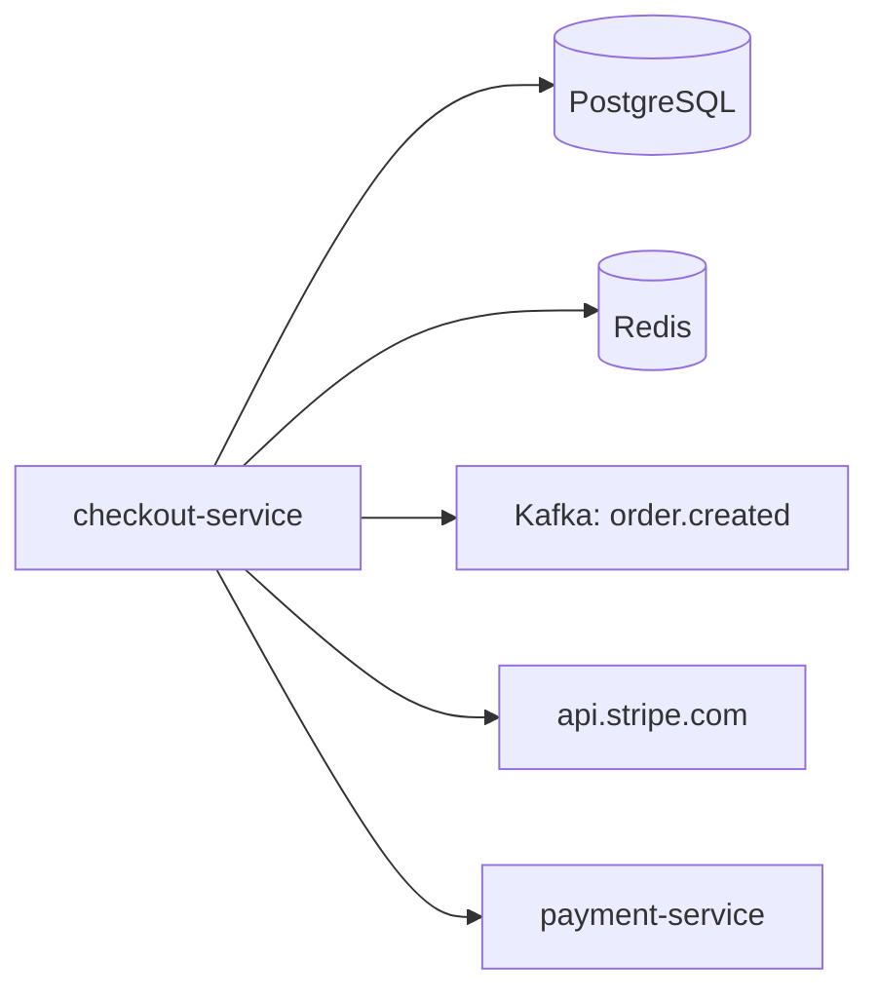

For every outbound span, capture:

- raw span kind,
- raw span attributes,
- resource attributes,
- Datadog peer identity,
- inferred entity name,
- inferred entity type,
- dependency metrics,
- Service/Dependency Map result.

### Attribute mutation matrix

Run controlled variants:

| Variant | Attribute change | Expected research value |
|---|---|---|
| A | `server.address` only | Hostname-based inference |
| B | logical peer + `server.address` | Test precedence |
| C | `db.namespace` + DB host | Database identity precedence |
| D | Kafka destination + broker | Messaging identity precedence |
| E | peer address as IP | Cardinality/IP handling |
| F | SDK sampling enabled | Metric accuracy impact |
| G | Collector sampling after `span_metrics` | Unsampled metric preservation |

### Output artifacts

- raw OTLP span fixtures,
- Collector configs,
- Datadog screenshots or exported query results,
- entity mapping table,
- metric comparison table,
- documented version matrix.

---

## 19. Working conclusion

For this repository, use the following conceptual definition:

> **Datadog Inferred Services are remote dependency entities derived from outbound telemetry, where Datadog resolves peer identity from span attributes and uses that identity in its dependency/entity and APM statistics model.**

The architectural lesson is broader:

```text
Tracing is not only about storing spans.

Span semantics
    -> identity resolution
    -> topology
    -> metrics
    -> entity model
```

This is one of the main areas where OpenTelemetry interoperability needs to be tested beyond protocol compatibility. Two systems may both support OTLP while deriving different service and dependency models from the same spans.

---

## References

### Datadog

- Inferred Services  
  https://docs.datadoghq.com/tracing/services/inferred_services/
- OpenTelemetry Trace Metrics  
  https://docs.datadoghq.com/opentelemetry/integrations/trace_metrics/
- Ingestion Sampling with OpenTelemetry  
  https://docs.datadoghq.com/opentelemetry/ingestion_sampling/
- Trace Metrics  
  https://docs.datadoghq.com/tracing/metrics/metrics_namespace/
- OpenTelemetry Getting Started  
  https://docs.datadoghq.com/opentelemetry/getting_started/
- DDSQL: Inferred Services  
  https://docs.datadoghq.com/ddsql_reference/data_directory/dd/dd.inferred_services.dataset/

### OpenTelemetry

- Semantic Conventions  
  https://opentelemetry.io/docs/specs/otel/semantic-conventions/
- General network attributes / `server.address`  
  https://opentelemetry.io/docs/specs/semconv/general/attributes/
- Service peer attributes  
  https://opentelemetry.io/docs/specs/semconv/registry/attributes/service/
- Database client spans  
  https://opentelemetry.io/docs/specs/semconv/db/database-spans/
- Kafka semantic conventions  
  https://opentelemetry.io/docs/specs/semconv/messaging/kafka/
