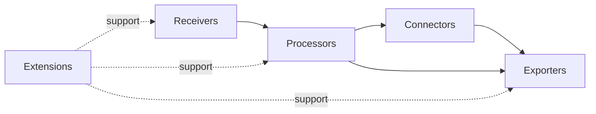

# OpenTelemetry Notes

## Topics

### Specification and architecture
- API vs SDK
- Resource
- InstrumentationScope
- Context and Baggage
- Propagators
- Semantic Conventions
- OTLP

### Signals
- Traces
- Metrics
- Logs
- Profiles

### Instrumentation
- Manual instrumentation
- Auto-instrumentation
- Zero-code instrumentation
- eBPF-based instrumentation
- Kubernetes Operator injection

### Collector

## Questions to answer

1. Which semantic conventions are stable vs development?
2. What compatibility contracts does OTLP provide?
3. How do SDK batching and Collector batching interact?
4. How does tail sampling affect trace completeness and memory?
5. What telemetry should never leave the workload boundary?
6. How do Collector failure modes surface back to applications?
